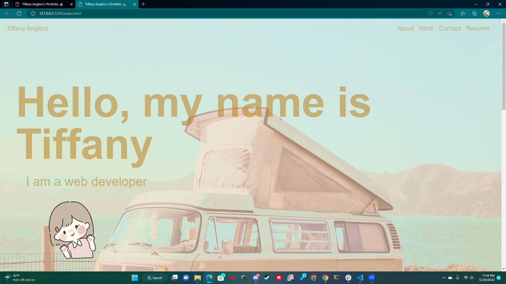
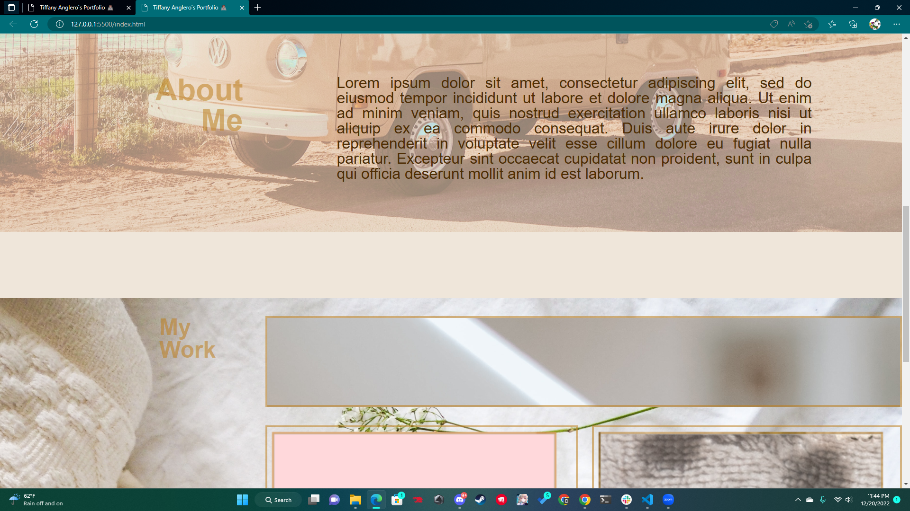
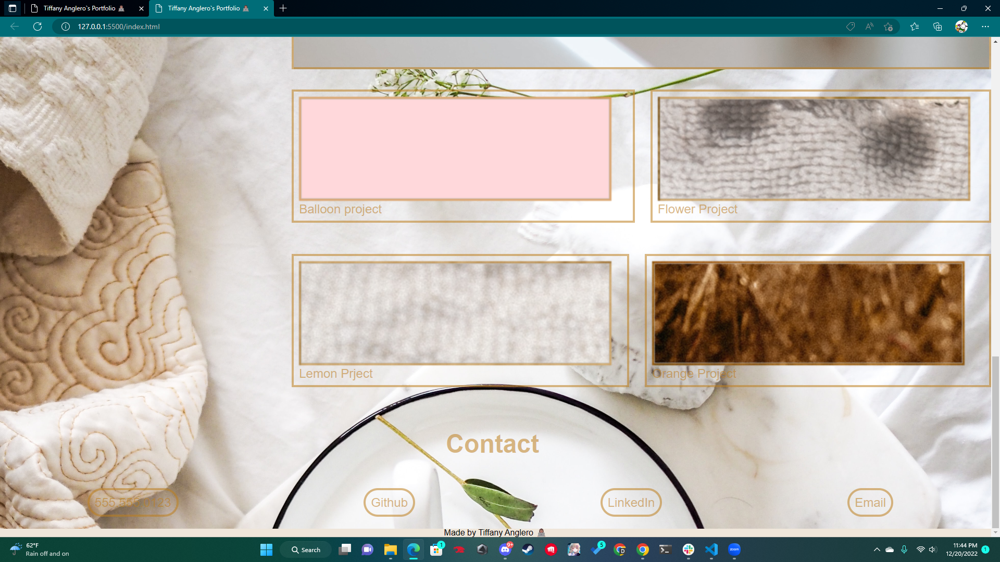

# Tiffany-Anglero-Portfolio

## Description

Provide a short description explaining the what, why, and how of your project. Use the following questions as a guide:

This portfolio was created to provide employers and fellow developers information about me, my work, resume and a means of contact all in one place.
This portfolio provides links to my projects.
While building this portfolio I learned to use flexbox, style elements and style images.

## Installation

N/A

## Usage

- Open up website: https://tanglero4.github.io/Tiffany-Anglero-Portfolio/
  
- Click on links in the navigation bar to be directed to the pertaining section or scroll down.
  
- Click on the project images to access the project websites.
  
- Click on links under the contact section to be direcated toi respective websites.

## Credits

UCF Coding Bootcamp

## License

N/A
